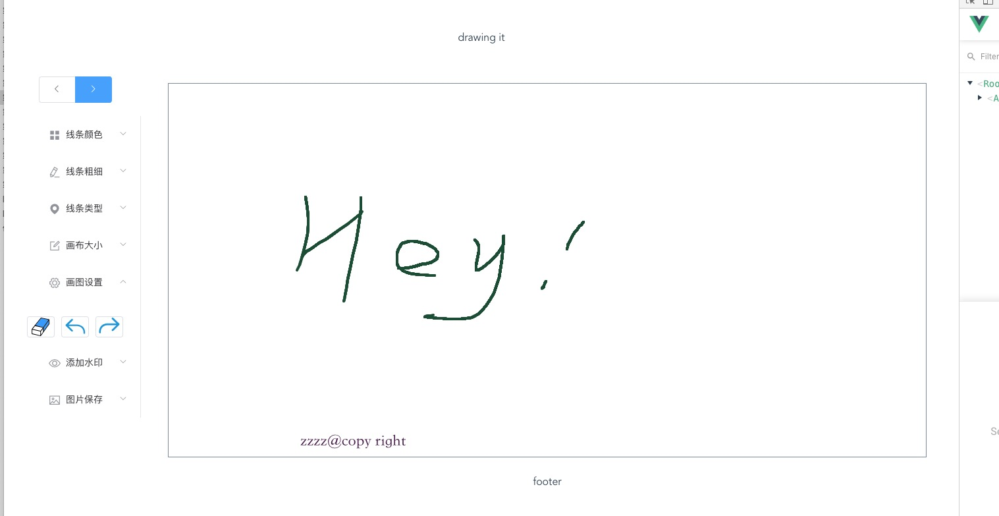

# vue-canvas

## Project setup
```
git clone https://github.com/tianjianen/vue-canvas.git

cd vue-canvas

yarn install
```

### Compiles and hot-reloads for development
```
yarn run serve
```

### Compiles and minifies for production
```
yarn run build
```

### Run your tests
```
yarn run test
```

### Lints and fixes files
```
yarn run lint
```

### Customize configuration
See [Configuration Reference](https://cli.vuejs.org/config/).


### 项目截图
[](https://tianjianen.github.io/vue-canvas.html)

> for the free
>[](https://996.icu)
[-blue.svg)](https://github.com/996icu/996.ICU/blob/master/LICENSE)